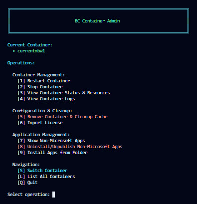

# Business Central Container Admin

Professional PowerShell tool for managing Business Central Docker containers locally. Select a container and perform operations from an organized, interactive menu.

## Features

- 🎯 Clean, organized menu interface
- 📦 Easy container selection and switching
- ⚙️ Complete container lifecycle management
- 📋 Professional formatting with color-coded operations
- 💨 Fast, no external dependencies
- 🔍 Real-time status and resource monitoring

## Screenshot



---

## Quick Start

```powershell
# Run the script
.\Admin.Containers.AsMenu.ps1

# Select a container when prompted
# Choose an operation from the menu
# Follow the prompts for each operation
```

The script presents an interactive menu where you can select operations using keyboard input.

---

## Available Operations

### Container Management

#### [1] Restart Container
**Purpose:** Stop and start the container to apply changes or recover from issues.

**Use when:**
- Container is acting strange or unresponsive
- Configuration changes require a restart
- You want a clean state without removing data

---

#### [2] Stop Container
**Purpose:** Gracefully stop the running container to free resources.

**Use when:**
- Done working and want to free CPU/memory
- Need to stop temporarily without deleting it
- Container is consuming too many resources

---

#### [3] View Container Status & Resources
**Purpose:** Display all containers and their resource usage (CPU, memory, network I/O).

**Use when:**
- Want to see which containers are running
- Checking memory/CPU consumption
- Troubleshooting performance issues

---

#### [4] View Container Logs
**Purpose:** Display Docker container system messages and error logs.

**Use when:**
- Container failed to start or crashed
- Looking for error messages for troubleshooting
- Checking recent container activity

---

### Configuration & Cleanup

#### [5] Remove Container & Cleanup Cache
**Purpose:** Permanently delete the container and clear BcContainerHelper cache (keeps 2 days of history).

**Use when:**
- Starting completely fresh with a new container
- Freeing up significant disk space
- Removing old/unused containers

⚠️ **Warning:** This is permanent and cannot be undone. Data will be lost.

---

#### [6] Import License
**Purpose:** Load a Business Central license file (.bclicense) into the container.

**Use when:**
- Setting up a new container (requires valid license)
- Trial license expired
- Switching to a different license

**Default path:** `C:\MILBAINAB\_License\NAB DEV License.bclicense`
You can specify a custom path if needed.

---

### Application Management

#### [7] Show Non-Microsoft Apps
**Purpose:** List all third-party and custom apps installed in the container.

**Use when:**
- Viewing installed custom apps
- Checking app versions and publishers
- Before uninstalling apps (inventory check)

---

#### [8] Uninstall/Unpublish Non-Microsoft Apps
**Purpose:** Selectively remove non-Microsoft apps from the container.

**Use when:**
- Removing custom apps no longer needed
- Cleaning container before deployment
- Testing app removal and reinstallation

**Options:** Choose which apps to remove and whether to uninstall only or fully unpublish.

⚠️ **Warning:** Operation affects production-like data.

---

#### [9] Install Apps from Folder
**Purpose:** Publish .app files from a folder into the container with automatic dependency resolution.

**Use when:**
- Deploying newly built .app files
- Testing app installations before production
- Upgrading apps to new versions

**Smart features:**
- Shows installation plan before executing
- Automatically sorts apps by dependencies
- Skips code signing verification (dev/test)
- Optionally unpublishes old app versions after upgrade
- Handles new installs, upgrades, and downgrades

---

### Navigation

#### [S] Switch Container
**Purpose:** Change to a different container for management.

---

#### [L] List All Containers
**Purpose:** Display all available Business Central containers.

---

#### [Q] Quit
**Purpose:** Exit the application.

---

## System Requirements

- **PowerShell:** Windows PowerShell 5.0+ or PowerShell Core
- **Docker:** Docker Desktop installed and running
- **Modules:** BcContainerHelper PowerShell module
- **Containers:** One or more Business Central containers

## Typical Workflow

1. Execute the script: `.\Admin.Containers.AsMenu.ps1`
2. Select your target container from the list
3. Choose an operation from the menu
4. Follow operation-specific prompts
5. Menu returns automatically after operation completes
6. Repeat or press `Q` to exit

## Output Formatting

The script provides professional, formatted output for all operations:

- **Settings tables** for confirmations (with dot-padding)
- **Summary tables** with color-coded results
- **Formatted lists** for inventory operations
- **Status indicators** (✓ for success, ✗ for errors)

---

## Examples

### Installing Apps from a Folder

```
1. Select "Install Apps from Folder"
2. Enter folder path containing .app files
3. Review installation plan
4. Confirm with 'YES'
5. App installations process automatically
6. View summary with success/failure counts
```

### Managing Non-Microsoft Apps

```
1. Select "Show Non-Microsoft Apps" to inventory
2. Select "Uninstall/Unpublish Non-Microsoft Apps" to remove
3. Choose specific apps to uninstall
4. Select uninstall vs. unpublish option
5. Confirm with 'YES'
6. View remaining apps summary
```

---

## Tips & Tricks

- **Default paths:** The script remembers common paths (like license location) for faster input
- **Input flexibility:** Accept container numbers or names when prompted
- **Safe defaults:** All destructive operations require explicit confirmation
- **Color coding:** Red indicates destructive operations, Green indicates success, Cyan indicates headers

---

## Troubleshooting

### Script runs from PowerShell but has issues in VS Code
- Restart VS Code's PowerShell extension: `Ctrl + Shift + P` → "PowerShell: Restart Session"
- Or run directly in standalone PowerShell instead of the integrated terminal

### Can't find containers
- Ensure Docker Desktop is running
- Verify containers exist: `docker ps -a`
- Check BcContainerHelper is installed: `Get-Module -ListAvailable BcContainerHelper`

### License import fails
- Verify license file path is correct
- Ensure license file has correct `.bclicense` extension
- Check file permissions and disk space

### App installation errors
- Check .app files are valid
- Verify dependencies are present in the folder
- Check container has sufficient disk space

---

## License

This script is provided as-is for Business Central container management.

## Support

For issues or feature requests, please refer to your organization's support channels or BcContainerHelper documentation.
